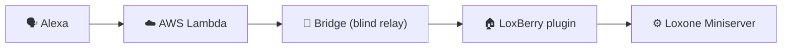

# Aloxberry — Alexa Smart Home plugin for Loxone

[](LICENCE)
[](https://www.loxwiki.eu/display/LOXBERRY/LoxBerry)

Open‑source Amazon Alexa Smart Home integration for the **Loxone** home
automation system, running as a **LoxBerry** plugin.

Control your Loxone home by voice — *"Alexa, turn off the living‑room lights"*,
*"Alexa, set the bedroom to 21 degrees"* — while keeping control: you choose
exactly which Loxone components Alexa can see, your LoxBerry is never exposed to
the internet, and the cloud relay can neither read nor forge your commands.

A single shared, free, open‑source cloud backend serves many independent
LoxBerry installations; users only install this plugin and link the "Aloxberry"
skill. The cloud parts are also self‑hostable.



## Documentation

| Audience | Start here |
|----------|-----------|
| 👤 **Users** (English) | [`doc/user/en/README.md`](doc/user/en/README.md) — purpose, security, setup, full Loxone↔Alexa device mapping |
| 👤 **Anwender** (Deutsch) | [`doc/user/de/README.md`](doc/user/de/README.md) |
| 🛠️ **Developers / self‑hosters** | [`doc/dev/README.md`](doc/dev/README.md) — architecture, components, bridge & AWS backend, security model, design decisions |

## At a glance

- **Requirement:** a LoxBerry ≥ 3.0 (ships Node.js 18 by default, as required
  by the plugin) with a configured Loxone Miniserver. Older LoxBerry versions
  are not supported. Nothing else — no port forwarding, no public IP.
- **Safety:** opt‑in per device, end‑to‑end HMAC (blind bridge), no inbound
  exposure, Loxone credentials never leave the LoxBerry, prominent kill
  switches. See [`doc/user/en/security.md`](doc/user/en/security.md).
- **Presence → Loxone:** turn an Echo's own person/occupancy detection
  (anonymous, or per‑person via Visual ID) into a Loxone state via an Alexa
  Routine — no plugin changes needed. See
  [`doc/user/en/presence.md`](doc/user/en/presence.md).
- **Garage doors ask for a voice code:** expose a Loxone gate in the
  `GARAGE_DOOR` category and Alexa demands a spoken code before opening it —
  checked in Amazon's cloud, never seen by the plugin or the bridge. See
  [`doc/user/en/gates.md`](doc/user/en/gates.md).
- **Self‑hosting:** run your own bridge and/or AWS backend — see
  [`doc/dev/`](doc/dev/README.md).

## Repository layout

```
.
├── plugin.cfg               # LoxBerry plugin manifest (plugin root)
├── bin/                     # Plugin daemon (Node.js) + Loxone Perl helpers
├── webfrontend/htmlauth/    # Plugin config UI (Perl CGI, authenticated)
├── templates/               # HTML::Template views + lang/ translations
├── cron/, config/, icons/   # Standard LoxBerry plugin dirs
├── uninstall/               # LoxBerry uninstall hook
│
├── bridge/                  # Dispatch bridge (NOT shipped with the plugin)
├── aws/                     # AWS Lambda backend + SAM (NOT shipped)
│
├── doc/                     # User + developer documentation
└── plan/                    # Design documents and implementation roadmap
```

`bridge/` and `aws/` live in this monorepo for development convenience but are
outside LoxBerry‑recognised plugin paths, so the installer ignores them.

## License

Apache License 2.0 — see [`LICENCE`](LICENCE).

Copyright © 2026 Martin Korndörfer
