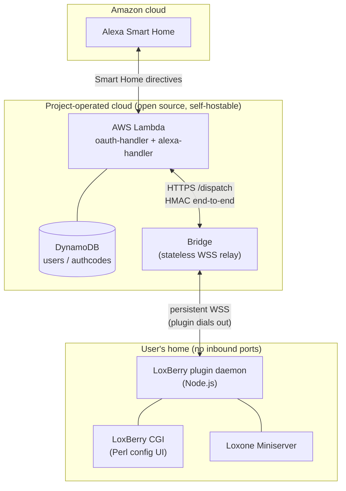

# Aloxberry — Technical / Developer Documentation

English only. For end‑user docs see [`doc/user/`](../user/en/README.md).

> ⚠️ **Public beta (v0.5.0)** — all components carry this version. Released for
> a limited group of friendly‑user testers; interfaces and the wire protocol
> may still change between versions.

This set explains **how the system is built and why**. It is for contributors,
reviewers, and anyone running their own bridge / AWS backend.

| Document | Contents |
|----------|----------|
| [architecture.md](architecture.md) | The four moving parts, end‑to‑end data flow, sequence diagrams. |
| [components.md](components.md) | Plugin daemon internals (module by module), the CGI, on‑disk files. |
| [bridge.md](bridge.md) | What the bridge is, **why it exists**, what it does, basics of self‑hosting. |
| [aws-backend.md](aws-backend.md) | The two Lambdas + DynamoDB + SSM, why they exist, basics of self‑hosting. |
| [security-model.md](security-model.md) | Identity, end‑to‑end HMAC, pair codes, Miniserver token handshake, threat model. |
| [decisions.md](decisions.md) | The non‑obvious technical decisions and their rationale. |

---

## System in one picture

**Four parts:**

1. **LoxBerry plugin** — a Node.js *daemon* (long‑lived process) plus a Perl
   *CGI* (the LoxBerry config UI). The daemon talks to the Loxone Miniserver
   locally and to the bridge over an outbound WebSocket.
2. **Bridge** — a tiny stateless relay with the only public TLS endpoint in the
   system. Routes signed directives to the right plugin. Cannot read or forge
   them.
3. **AWS backend** — two Lambdas (OAuth account linking + Alexa directive
   dispatch), DynamoDB, SSM SecureStrings.
4. **Amazon Alexa** — the "Aloxberry" Smart Home skill.

## Tech stack

| Part | Stack |
|------|-------|
| Plugin daemon | Node.js (bundled with LoxBerry), `ws`, `chokidar`. No web framework. |
| Plugin UI | Perl CGI (LoxBerry `HTML::Template` + `LoxBerry::*` modules). |
| Bridge | Node.js, plain `http` + `ws`. Stateless. Docker + Caddy for TLS. |
| AWS | Lambda (Node.js 24, arm64), DynamoDB, API Gateway (HTTP API), SSM, SAM IaC. |
| Crypto | HMAC‑SHA256 (end‑to‑end), JWT via `jose`, Loxone SHA1/SHA256 token auth. |

## Design north stars

- **The user distrusts the cloud by default.** Every architectural choice
  minimises what any cloud component can see or do. See
  [security-model.md](security-model.md).
- **No inbound exposure of the user's network.** The plugin always dials out.
- **The shared backend is a convenience, not a dependency.** Every cloud
  component is open source and self‑hostable.
- **Config lives where LoxBerry preserves it.** Identity + device mapping sit
  in `$LBPCONFIG`, surviving upgrades.
