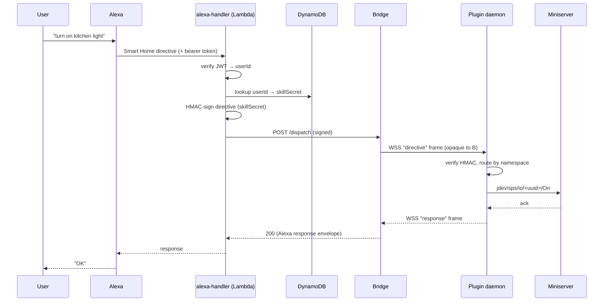
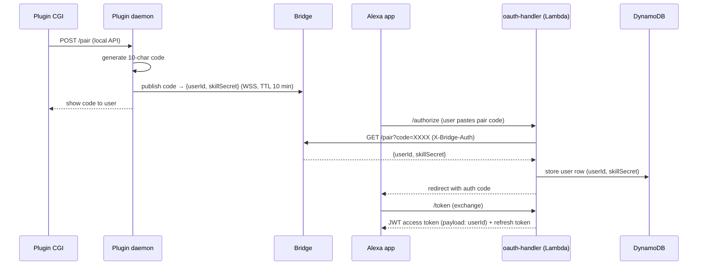
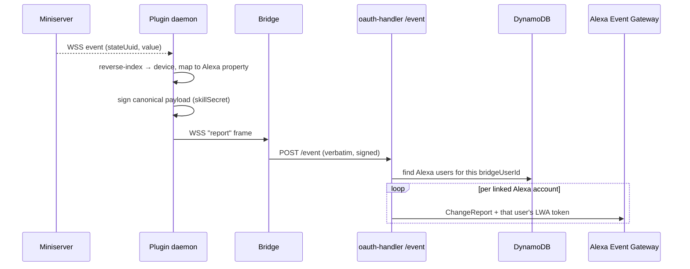
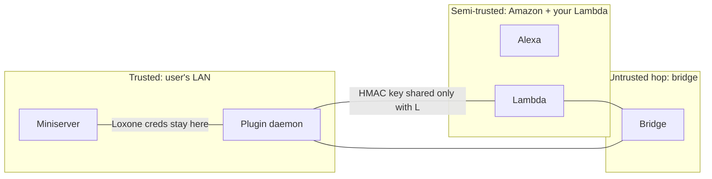

# Architecture

[← Dev index](README.md)

## Why it looks like this

A naïve Alexa Smart Home integration would expose an HTTPS endpoint on the
user's network for Amazon to call. That requires a public IP / DynDNS, an open
port, and a valid TLS certificate per user — and it puts the home automation
box directly on the internet. Aloxberry rejects that. Instead:

- The plugin **dials out** and holds a persistent WebSocket to a **bridge**.
- A shared **AWS backend** is what Amazon's skill actually talks to (Smart Home
  skills require a Lambda endpoint anyway).
- The backend hands directives to the bridge, which relays them down the
  already‑open socket to the right plugin.
- **End‑to‑end HMAC** between Lambda and plugin means the bridge — the only
  multi‑tenant, publicly reachable hop — is a *blind relay*.

The result: many independent LoxBerry installs share one free backend, nobody
opens a port, and no intermediary can read or forge a user's commands.

## The four parts

| Part | Process / location | Responsibility |
|------|--------------------|----------------|
| Plugin **daemon** | Node.js, on the LoxBerry | Loxone comms, directive execution, identity, bridge socket, local API |
| Plugin **CGI** | Perl, on the LoxBerry | Config UI: device picker, pairing, status, settings |
| **Bridge** | Node.js, project‑hosted or self‑hosted | Stateless routing of signed directives ↔ plugins |
| **AWS backend** | Lambda + DynamoDB + SSM | Account linking (OAuth), directive dispatch, fan‑out of state events |

## Directive flow (e.g. "Alexa, turn on the kitchen light")

Key point: the bridge in the middle never parses `directive` or `response`. It
matches `userId` → socket and forwards bytes. The HMAC is verified only at the
plugin, signed only at the Lambda.

## Account linking flow (pair‑code model)

Alexa Account Linking is OAuth2 Authorization Code Grant. Aloxberry layers a
**single‑use pair code** on top so the user never types Loxone or LoxBerry
credentials into an Amazon‑hosted form.

After linking, every directive carries the JWT; the Lambda decodes `userId`,
loads the matching `skillSecret`, and the directive flow above runs.

## Outbound state reports (proactive updates)

When a Loxone state the user exposed changes, Alexa should reflect it (and
Routines should be able to trigger). The plugin pushes a **ChangeReport**:

One daemon event fans out to N linked Alexa accounts; the Lambda owns the
per‑user LWA tokens, the daemon signs once.

## Trust boundaries

- **Loxone credentials**: never leave T1.
- **`skillSecret` (HMAC key)**: shared only between the plugin (T1) and the
  Lambda (T2). The bridge (T3) never has it.
- **The bridge**: assumed hostile in the threat model and still can't forge or
  read commands. Detail in [security-model.md](security-model.md).
