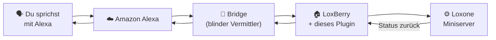

# Alexa Aloxberry — Benutzerdokumentation

🇬🇧 **[This documentation in English →](../en/README.md)**

> ⚠️ **Öffentliche Beta (v0.5.0).** Diese Version ist eine öffentliche Beta für
> eine begrenzte Anzahl freundlicher Tester. Sie funktioniert, hat aber noch
> Ecken und Kanten, kann zwischen Updates inkompatible Änderungen haben und
> gelegentlich ein erneutes Verknüpfen von Alexa erfordern. Rückmeldungen sind
> sehr willkommen.

Steuere deine **Loxone**-Hausautomation per Sprache über **Amazon Alexa** —
„Alexa, mach das Wohnzimmerlicht aus", „Alexa, stelle das Schlafzimmer auf
21 Grad", „Alexa, fahre die Jalousien runter".

Dieses Plugin läuft auf deinem **LoxBerry** und verbindet deinen Loxone
Miniserver mit dem Alexa-Smart-Home-Skill **„Aloxberry"**. Du entscheidest
genau, welche Loxone-Komponenten Alexa sehen darf und was Alexa damit tun darf.

---

## Was es macht

- **Sprachsteuerung** von Licht, Jalousien, Heizung, Musikzonen, Szenen u. v. m.
- **Statusrückmeldung**: Alexa kann die aktuelle Temperatur nennen, ob ein
  Fenster offen ist usw., und in **Routinen** auf Änderungen reagieren.
- **Du wählst die Geräte**: Aus deiner Loxone wird nichts automatisch
  freigegeben. Du fügst jedes Control ausdrücklich im Tab *Geräte* hinzu.
- **Mehrbenutzerfähig**: Ein gemeinsames, kostenloses, quelloffenes
  Cloud-Backend bedient viele LoxBerry-Nutzer — die Cloud sieht deine
  Loxone-Daten aber niemals im Klartext (siehe *Sicherheit*).

---

## Hauptfunktionen

| Bereich | Was du bekommst |
|---------|-----------------|
| Beleuchtung | Ein/Aus, Dimmen, Farbe, Farbtemperatur, Lichtszenen |
| Beschattung | Jalousien, Rollläden, Fenster, Tore — Position per Sprache |
| Klima | Raumregler / Klimaanlage: Zieltemperatur, Modus, Lüfterstufe |
| Lüftung | Ein/Aus, Stufe, Modus (zeitlich begrenzte Übersteuerung) |
| Audio | Loxone-Music-Server-Zonen: Lautstärke, Stumm, Play/Pause, Quelle |
| Szenen | Loxone-Taster & Sequenzen als Alexa-Szenen / -Routinen |
| Sensoren | Präsenz, Fenster/Kontakt, Temperatur, Feuchte (nur lesend) |
| Sicherheits­schalter | Haupt-Aus-Schalter, „Pause wenn Virtual Status aktiv" |

---

## Dokumentation

| Thema | Hier nachlesen |
|-------|----------------|
| 🔒 **Warum es sicher ist** | [security.md](security.md) |
| 🛠️ **Voraussetzungen & Einrichtung** | [setup.md](setup.md) |
| 🔗 **Loxone-↔-Alexa-Zuordnung** | [devices.md](devices.md) |

Englische Fassungen: [Security](../en/security.md) ·
[Setup](../en/setup.md) · [Devices](../en/devices.md)

> Technische/Architektur-Dokumentation: siehe
> [`doc/dev/`](../../dev/README.md) (nur Englisch, für Entwickler & Selbst-Hoster).

---

## Kurz gesagt — wird außer einem LoxBerry etwas benötigt?

**Nein.** Du brauchst einen **LoxBerry 1.4.3 oder neuer** (LoxBerry 3.x
empfohlen) mit installiertem Plugin und einen Loxone Miniserver, mit dem er
ohnehin schon kommuniziert. Die Cloud-Teile (AWS Lambda + die Vermittlungs-
*Bridge*) werden **vom Projekt kostenlos bereitgestellt** und von allen
Nutzern gemeinsam verwendet.

Wenn du dich nicht auf die Community-Infrastruktur verlassen möchtest, kannst
du **deine eigene Bridge und dein eigenes AWS-Lambda-Backend betreiben** —
alles ist Open Source. Siehe
[setup.md → Eigene Infrastruktur betreiben](setup.md#eigene-infrastruktur-betreiben).

---

## Lizenz

Apache-Lizenz 2.0. Copyright © 2026 Martin Korndörfer.
