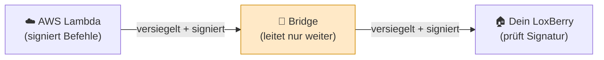

# Warum Aloxberry sicher zu nutzen ist

[← Zurück zur Übersicht](README.md) · 🇬🇧 [English](../en/security.md)

Eine Hausautomation mit einem Cloud-Sprachassistenten zu verbinden, macht
zu Recht nervös. Aloxberry ist von Grund auf so gebaut, dass **Misstrauen
gegenüber der Cloud die Standardannahme ist**. Diese Seite erklärt die
konkreten Gründe, warum es sicher ist.

---

## 1. Alles ist Open Source

Es gibt keine geschlossenen Programmdateien und keine versteckten Dienste. Der
komplette Code — das LoxBerry-Plugin, die Vermittlungs-*Bridge* und das
AWS-Lambda-Backend — ist öffentlich und überprüfbar. Du kannst genau nachlesen,
was läuft, und bei Bedarf jede Cloud-Komponente selbst betreiben (siehe
[setup.md → Eigene Infrastruktur betreiben](setup.md#eigene-infrastruktur-betreiben)).

## 2. Die Bridge ist blind für deine Befehle

Zwischen Amazon und deinem LoxBerry sitzt ein kleiner Vermittler, die
**Bridge**. Sie existiert nur, damit Alexa deinen LoxBerry erreichen kann, ohne
dass du Ports öffnest oder dein Zuhause ins Internet stellst.

Der entscheidende Punkt: **Die Bridge kann deine Befehle weder lesen noch
fälschen.**

Jeder Befehl wird **Ende-zu-Ende kryptografisch signiert (HMAC-SHA256)** —
zwischen der AWS-Lambda und deinem Plugin, mit einem Geheimnis, das **nur diese
beiden** besitzen. Die Bridge sieht nur undurchsichtige, signierte Bytes. Sie
kann sie weiterreichen oder verweigern — aber sie **kann einen Befehl nicht
ändern, keinen neuen erfinden und nicht mithören**, was du steuerst. Eine
bösartige oder kompromittierte Bridge kann dein Haus trotzdem nicht
fernsteuern.

Die Bridge hat zudem **keine Datenbank** — sie hält Verbindungen nur im
Arbeitsspeicher und hat nichts, das man sichern oder stehlen könnte. Auf Wunsch
kannst du die Bridge selbst hosten.

## 3. Dein LoxBerry ist nie aus dem Internet erreichbar

Das Plugin **wählt sich nach außen** zur Bridge über eine verschlüsselte
WebSocket-Verbindung. Du öffnest **keinen** Port, brauchst **keine** öffentliche
IP, und dein LoxBerry ist durch dieses Plugin **nicht** aus dem Internet
erreichbar. Die Verbindung wird immer von innen aus deinem Netzwerk
aufgebaut.

## 4. Deine Loxone-Zugangsdaten verlassen den LoxBerry nie

Das Plugin nutzt die Miniserver-Verbindung, die LoxBerry ohnehin verwaltet.
Dein Loxone-Benutzername und -Passwort bleiben auf dem LoxBerry. Sie werden
**niemals** an die Bridge, an AWS oder an Amazon gesendet.

## 5. Nichts wird ohne deine ausdrückliche Zustimmung freigegeben

Die Geräteerkennung ist **pro Gerät und Opt-in**. Standardmäßig sieht Alexa
**nichts**. Ein Loxone-Control wird für Alexa erst sichtbar, nachdem **du** es
im Tab *Geräte* hinzugefügt und gespeichert hast. Alles, was du nicht
hinzufügst, bleibt unsichtbar — keine Befehle, kein Status, nichts.

## 6. Du hast gut sichtbare Not-Aus-Schalter

Der Tab *Geräte* bietet harte Stopps, keine vergrabenen Einstellungen:

| Schalter | Wirkung |
|----------|---------|
| **Alexa-Integration aktiv** (Hauptschalter) | Wenn aus, **kappt das Plugin jegliche Bridge-Kommunikation**. Alexa erreicht diesen LoxBerry gar nicht mehr, bis du ihn wieder einschaltest. |
| **Alexa-Befehle pausieren, wenn ein Virtual Status aktiv ist** | Solange der von dir gewählte Loxone **Virtual Status** EIN ist, werden **Alexa-Befehle an den Miniserver blockiert**, während der Status weiterhin fließt. Ein sicherer Einbahn-Modus. Siehe Abschnitt 6a zur Einrichtung. |
| **„Aktiv"-Häkchen pro Gerät** | Verbirgt ein einzelnes Gerät vor Alexa, ohne dessen Konfiguration zu verlieren. |
| **„Alle Alexa-Verknüpfungen löschen"** (Gefahrenbereich) | Erzeugt eine neue Plugin-Identität. **Jede bestehende Alexa-Verknüpfung wird sofort ungültig** und muss in der Alexa-App neu eingerichtet werden — dein Notfall-„Alles trennen"-Knopf. |

## 6a. Empfehlung: der Virtual Status „Alexa-Steuerung deaktivieren"

Loxone bietet **keine** Möglichkeit, von außen auszulesen, ob ein
benutzerdefinierter Betriebszustand (*Betriebsart*, z. B. „Silentio",
„Abwesend") aktiv ist — `globalStates.operatingMode` meldet immer nur den
Kalender-Wochentag/die Saison, nie deine eigenen Modi. Deshalb versucht
das Plugin **bewusst nicht**, Betriebszustände auszulesen. Stattdessen
beobachtet es **einen Virtual Status**, den *du* in Loxone Config
steuerst. Empfohlene Einrichtung:

1. In **Loxone Config** ein **Virtual Status**-Objekt anlegen.
2. Eindeutig benennen, z. B. **„Alexa-Steuerung deaktivieren"**.
3. Seinen Eingang mit dem verdrahten, was Alexa pausieren soll:
   - einem **manuellen Schalter** (virtuell oder physisch, den du selbst
     umlegst), und/oder
   - direkt mit einem **Betriebszustand**, z. B. dem Ausgang des
     Betriebsmodus **„Abwesend"** — so pausiert das Verlassen des Hauses
     Alexa automatisch.
   (Mehrere Quellen lassen sich per ODER kombinieren — Schalter *oder*
   Abwesend.)
4. Auf den Miniserver speichern, damit der neue Virtual Status im Katalog
   des Plugins erscheint.
5. Im Plugin auf der **Geräte**-Seite **„Alexa-Befehle pausieren, wenn ein
   Virtual Status aktiv ist"** aktivieren und deinen Virtual Status
   „Alexa-Steuerung deaktivieren" aus der Liste wählen. Speichern.

Es werden ausschließlich Virtual-Status-Objekte gelistet und akzeptiert —
nichts anderes. Solange dieser Virtual Status **EIN** ist, kann Alexa
nichts mehr am Miniserver ändern (Status fließt weiterhin zurück). Kennt
das Plugin den Wert noch nicht, entscheidet es **offen** (Befehle erlaubt)
statt fälschlich zu blockieren.

## 7. Die Verknüpfung erteilst und widerrufst du

Die Verknüpfung erfolgt über einen **einmalig nutzbaren, 10-stelligen
Pair-Code**, den du im Plugin erzeugst und in die Alexa-App einfügst. Er läuft
nach 10 Minuten ab. Es werden keine Passwörter mit Amazon geteilt. Den Skill in
der Alexa-App zu entkoppeln oder „Alle Alexa-Verknüpfungen löschen" zu drücken,
widerruft den Zugriff.

---

## Zusammenfassung

| Bedenken | Wie Aloxberry damit umgeht |
|----------|--------------------------|
| „Kann die Cloud mein Zuhause ausspähen?" | Ende-zu-Ende-Signatur; die Bridge sieht nur undurchsichtige Bytes; kein zentraler Speicher deiner Daten. |
| „Öffnet das meinen LoxBerry für Angreifer?" | Keine eingehenden Ports; das Plugin wählt sich nur nach außen. |
| „Gehen meine Loxone-Passwörter zu Amazon?" | Nein — sie verlassen den LoxBerry nie. |
| „Was wird freigegeben?" | Nur, was du ausdrücklich hinzufügst, Gerät für Gerät. |
| „Kann ich es sofort stoppen?" | Hauptschalter, Betriebszustand-Pause und Ein-Klick-Verknüpfungslöschung. |
| „Muss ich den Servern des Projekts vertrauen?" | Nein — jede Cloud-Komponente ist Open Source und selbst hostbar. |
