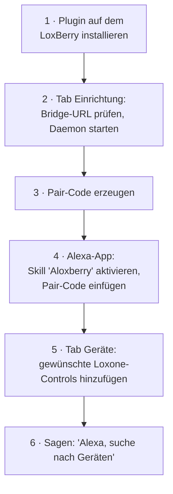

# Voraussetzungen & Einrichtung

[← Zurück zur Übersicht](README.md) · 🇬🇧 [English](../en/setup.md)

## Was du brauchst

| Voraussetzung | Hinweise |
|---------------|----------|
| **Ein LoxBerry** | **Version 3.0 oder neuer wird benötigt.** Ältere LoxBerry-Versionen werden nicht unterstützt. |
| **Node.js 18 oder neuer** | Wird vom Plugin-Daemon benötigt. LoxBerry 3.0 liefert Node.js 18 standardmäßig mit, ein normaler LoxBerry 3.0 erfüllt diese Voraussetzung also bereits. |
| **Ein Loxone Miniserver** | In LoxBerry bereits eingerichtet (Einstellungen → Miniserver). Das Plugin nutzt diese Verbindung — du gibst hier **keine** Loxone-Zugangsdaten ein. |
| **Ein Amazon-Konto mit Alexa** | Die Alexa-App auf dem Handy, angemeldet. |
| **Internetzugang vom LoxBerry** | Nur ausgehend. Keine Portweiterleitung, keine öffentliche IP, kein DynDNS nötig. |

Mehr nicht. Die Cloud-Teile (AWS-Lambda-Backend + die Vermittlungs-*Bridge*)
werden **vom Projekt kostenlos bereitgestellt**. Fortgeschrittene können sie
selbst hosten — siehe
[Eigene Infrastruktur betreiben](#eigene-infrastruktur-betreiben).

---

## Einrichtung Schritt für Schritt

### 1. Plugin installieren

Installiere es wie jedes LoxBerry-Plugin (Plugin-Verwaltung → `.lbplugin`-Datei
hochladen oder Auto-Update-URL verwenden). Ein Hintergrunddienst (der *Daemon*)
wird eingerichtet und startet automatisch beim Booten.

### 2. Tab *Einrichtung* öffnen

Du siehst den Live-Status für **Daemon**, **Bridge** und **Miniserver**.

- Die **Bridge-URL** ist mit der Community-Bridge vorbelegt. So lassen, außer du
  betreibst eine eigene.
- Der **lokale API-Port** kann auf dem Standard bleiben.
- Klicke **Starten**, falls der Daemon nicht läuft. *Bridge* sollte grün werden
  („verbunden"); *Miniserver* wird grün, sobald die Loxone-Struktur gelesen
  wurde.

### 3. Pair-Code erzeugen

In der Karte **Mit Alexa verknüpfen** auf **Pair-Code anzeigen** klicken. Du
erhältst einen **10-stelligen, einmalig nutzbaren Code, der in 10 Minuten
abläuft**. Kopiere ihn.

### 4. Skill in der Alexa-App verknüpfen

In der Alexa-App: **Mehr → Skills & Spiele → „Aloxberry" suchen → Zur Verwendung
aktivieren → Konto verknüpfen**. Den Pair-Code in das Formular einfügen und
absenden. Das Formular wandelt automatisch in Großbuchstaben um; es verwendet
ein eindeutiges Alphabet (keine Verwechslung `O`/`0`, `I`/`1`).

Bestätigt das Formular den Erfolg, ist das Konto verknüpft. Aktive
Verknüpfungen erscheinen im Plugin unter **Aktive Verknüpfungen**.

### 5. Gewünschte Geräte hinzufügen

Wechsle zum Tab **Geräte**. Links steht dein **Loxone-Katalog** (Räume,
Controls, Typen — vom Miniserver gelesen). Für jedes Control, das Alexa nutzen
soll:

1. **Hinzufügen** klicken. Es wandert in die Liste **Für Alexa freigegeben**.
2. Den **Anzeigenamen** anpassen (das, was du sagst: *„Alexa, schalte … ein"*)
   — eindeutig und gut aussprechbar wählen.
3. Optional **Kategorie**, **Fähigkeiten** und gerätespezifische
   **Einstellungen** ändern. Siehe [devices.md](devices.md): was jede
   Option bedeutet und welches Loxone-Control welcher Alexa-Funktion
   entspricht.
4. **Änderungen speichern** klicken.

### 6. Alexa erkennen lassen

Sage **„Alexa, suche nach Geräten"** (oder *Geräte → Geräte suchen* in der
App). Deine neuen Geräte erscheinen und sind sprachsteuerbar. Wiederhole die
Suche, wann immer du Geräte hinzufügst oder umbenennst.

---

## Alltag & Fehlersuche

| Symptom | Prüfen |
|---------|--------|
| Bridge zeigt „getrennt" | Läuft der Daemon? Hat der LoxBerry Internet? Stimmt die Bridge-URL? |
| Miniserver zeigt „getrennt" | LoxBerry-Miniserver-Einstellungen prüfen; das Plugin nutzt diese Verbindung. |
| Neues Gerät erscheint nicht in Alexa | **Änderungen gespeichert** und dann **„Alexa, suche nach Geräten"** gesagt? Ist das „Aktiv"-Häkchen gesetzt? |
| Alexa meldet Gerät reagiert nicht | Daemon gestoppt, Hauptschalter aus oder die Virtual-Status-Pause ist aktiv. |
| Alles schnell widerrufen | *Einrichtung → Gefahrenbereich → Alle Alexa-Verknüpfungen löschen*, danach neu verknüpfen. |

Logs findest du im Tab **Logs** (und per SSH für ein Live-Tail).

### Miniserver-Verbindungsmodus

Standardmäßig hält der Daemon **eine permanente WebSocket-Verbindung** zum
Miniserver und erhält Zustandsänderungen sofort (Modus *Live*). Bei manchen
Miniservern — beobachtet auf Gen-2-Hardware — kann der Netzwerk-Stack unter
dauerhaften Verbindungen Probleme entwickeln, bis hin zum kompletten
Einfrieren der Ethernet-Schnittstelle.

Wenn das bei dir passiert, stelle *Einrichtung → Einstellungen →
Miniserver-Verbindung* auf **Polling** um. Der Daemon hält dann **gar keine
permanente Verbindung mehr**: Im eingestellten Intervall (Standard 10
Minuten) verbindet er sich kurz, liest einen vollständigen Zustands-Snapshot
und trennt die Verbindung wieder.

Der Kompromiss: Zustandsänderungen (Sensorwerte, manuell geschaltete
Lampen, …) erreichen Alexa mit bis zu einem Intervall Verzögerung — sichtbar
in der Alexa-App und in Routinen, die auf Gerätezustände reagieren.
**Sprachbefehle sind nicht betroffen**: Sie werden in beiden Modi sofort
ausgeführt, weil Befehle ohnehin über kurze einmalige HTTP-Anfragen laufen.

---

## Eigene Infrastruktur betreiben

Alles ist Open Source. Du musst die geteilte Cloud des Projekts nicht
verwenden — du kannst die beiden Cloud-Teile selbst betreiben:

- **Eigene Bridge.** Ein kleiner, zustandsloser Vermittler (Node.js).
  Empfohlene Bereitstellung: Docker Compose + Caddy, das automatisch ein
  Let's-Encrypt-Zertifikat besorgt; Cloudflare Tunnel wird für
  CGNAT-/Keine-öffentliche-IP-Fälle unterstützt. Danach einfach die URL im Tab
  *Einrichtung* im Feld **Bridge-URL** eintragen. Vollständige Anleitung:
  [`bridge/README.md`](../../../bridge/README.md) · technischer Hintergrund:
  [Dev-Doku → Bridge](../../dev/bridge.md).
- **Eigenes AWS-Lambda-Backend.** Mit AWS SAM aus dem Verzeichnis
  [`aws/`](../../../aws/) bereitgestellt. Das bedeutet deinen eigenen privaten
  Alexa-Skill. Technischer Hintergrund: [Dev-Doku → AWS-Backend](../../dev/aws-backend.md).

Da Befehle Ende-zu-Ende signiert sind, sieht selbst die Community-Bridge deine
Befehle nie im Klartext (siehe [security.md](security.md)).
Selbst-Hosting geht es um **Unabhängigkeit und Kontrolle**, nicht darum, eine
Sicherheitslücke zu schließen.
