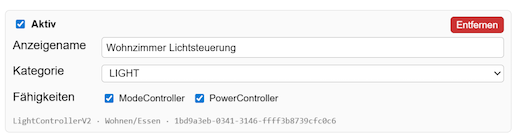
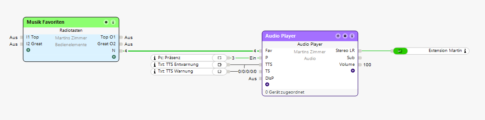
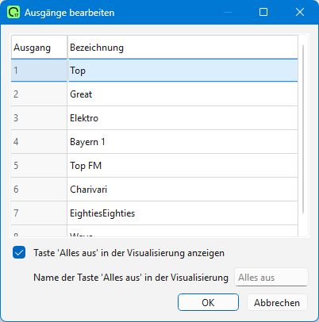
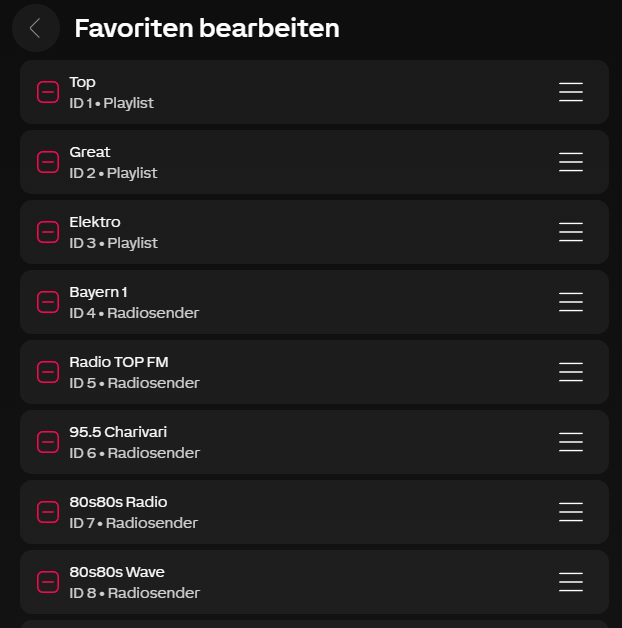

# Tipps & How-Tos für besondere Anwendungsfälle

[← Zurück zur Übersicht](README.md) · 🇬🇧 [English](../en/tips.md)

Manche Loxone-Bausteine haben Eigenheiten in der Sprachsteuerung, die nicht
offensichtlich sind — entweder weil Alexa mit eigenen Funktionen
dazwischenfunkt, oder weil eine Funktion zwar in Loxone existiert, aber per
Alexa-Standardvokabular nur über einen Umweg ansprechbar ist. Diese Seite
sammelt die wichtigsten Tipps und Workarounds.

> Siehe auch: [devices.md](devices.md) für die vollständige Zuordnungstabelle
> Loxone-Baustein → Alexa-Kategorie/Fähigkeiten, [audio.md](audio.md) für
> das Hintergrundwissen, warum Alexa Musikbefehle gerne kapert, und
> [presence.md](presence.md) dafür, wie die geräteeigene Personen-/
> Belegungserkennung eines Echo einen Loxone-Zustand setzt.

---

## 1. Lichtstimmungen (Lichtszenen) per Sprache aktivieren

Lichtstimmungen einer Loxone-**Lichtsteuerung** (`LightControllerV2` bzw.
`LightController`) werden als **Modi** an Alexa übertragen — jede in der
Loxone-App benannte Stimmung („Abendessen", „TV", „Lesen" …) wird damit per
Sprache aktivierbar. Vielen Nutzern ist nicht klar, dass das funktioniert,
weil im Tab *Geräte* nur „Power" und „Modus" stehen — kein Wort von
Stimmungen.

### 1.1 Lichtsteuerung im Tab *Geräte* korrekt freigeben

Damit Alexa die Stimmungen sieht, muss die Lichtsteuerung mit **beiden**
Fähigkeiten **PowerController** *und* **ModeController** und in der Kategorie
**`LIGHT`** freigegeben werden:

> *PowerController* allein gibt nur Ein/Aus. Erst zusammen mit
> *ModeController* erscheinen die in Loxone benannten Stimmungen als
> Alexa-Modi.

Nach dem Speichern einmal **„Alexa, suche nach Geräten"** sagen, damit Alexa
die neuen Modi übernimmt.

### 1.2 Eindeutige Stimmung — Kurzform

Wenn der Stimmungsname **über alle freigegebenen Lichtsteuerungen hinweg
eindeutig** ist (also nicht zweimal gleich heißt), reicht die Kurzform:

> **„Alexa, aktiviere die Stimmung Abendessen"** → Alexa setzt die passende
> Lichtsteuerung auf die Stimmung *Abendessen*.

### 1.3 Mehrdeutige Stimmung — Bausteinnamen dazu sagen

Heißt eine Stimmung auf **mehreren** Lichtsteuerungen gleich (z.B.
„Abendessen" sowohl im Wohnzimmer als auch im Esszimmer), nennst du den
Baustein explizit:

> **„Alexa, setze Wohnzimmer Lichtsteuerung auf Abendessen"**

Das ist die generische Alexa-Modus-Grammatik *„setze \<Gerät\> auf
\<Modus\>"*. Sie funktioniert auch dann, wenn der Name eindeutig wäre — eine
verlässliche Rückfallebene, falls Alexa die Kurzform mal nicht versteht oder
das falsche Gerät trifft.

### 1.4 Alexa+ mit Raumkontext

Wenn du **Alexa+** nutzt und in der Alexa-App festgelegt hast, in welchem
Raum welcher Echo steht, reicht meist sogar:

> **„Alexa, aktiviere Abendessen"**

Alexa+ verknüpft den Raum, aus dem du sprichst, automatisch mit der dort
zugeordneten Lichtsteuerung — du musst den Bausteinnamen nicht mehr
aussprechen.

### 1.5 Tipps zur Benennung

- **Stimmungsnamen kurz und gut aussprechbar** halten — der Name *ist* der
  Sprachbefehl.
- **Stimmungen innerhalb einer Lichtsteuerung** müssen eindeutig sein
  (sonst kennt das Plugin nur die erste). **Gleichnamige Stimmungen auf
  verschiedenen Lichtsteuerungen** sind erlaubt; du erkaufst dir damit nur,
  dass du den Bausteinnamen mitsprechen musst (§1.3).
- Anders als bei Audio (siehe [audio.md](audio.md)) musst du hier **nicht**
  vermeiden, dass Namen wie Amazon-Inhalte klingen — Stimmungen werden über
  einen Alexa-Modus aktiviert, nicht über die Musik-Spracherkennung, und
  fallen daher nicht der Amazon-Music-Kaperung zum Opfer.

---

## 2. Audioserver-Favoriten per Sprache starten (Radio→`Fav`-Workaround)

Der **Audio Player** (`AudioZoneV2`, also der Loxone **Audioserver**) hat
zwar Zonenfavoriten, die Loxone-API gibt sie aber nicht an den Miniserver
weiter — das Plugin kann sie deshalb nicht als Alexa-Quelle anbieten.
Hintergrund: [audio.md → Was AudioZoneV2 nicht kann und warum](audio.md).

Der erprobte Ausweg: ein **Radio**-Baustein, dessen Ausgang auf den
`Fav`-Eingang des Audio Players geht. Jede Radiotaste wählt damit einen
Zonenfavoriten — und der Radio-Baustein wird vom Plugin als Szene an Alexa
freigegeben, sodass jede beschriftete Taste per Sprache ansprechbar ist.

Du sagst dann:

> **„Alexa, aktiviere \<Favoritname aus dem Radio-Baustein\>"**

### 2.1 Radio-Baustein mit dem `Fav`-Eingang verbinden

Füge in **Loxone Config** einen **Radio**-Baustein („Radiotasten") hinzu und
verbinde dessen **`N`**-Ausgang mit dem **`Fav`**-Eingang des Audio Players:

### 2.2 Radio-Ausgänge beschriften

Gib jedem Radio-Ausgang eine **sprachsichere Bezeichnung** (siehe
[audio.md → Namens-Disziplin](audio.md#1-warum-alexa-audio-schwierig-ist-zuerst-lesen)
— genau diese Bezeichnungen sagst du zu Alexa). Bearbeite die Ausgänge
(„Ausgänge bearbeiten"):

### 2.3 Radio-Nummer mit der Loxone-Favoriten-**ID** abgleichen

Dieser Schritt entscheidet über Erfolg oder Misserfolg:

- Der **Radio**-Baustein gibt die Werte **1–16** aus (Ausgangsnummer).
- In der **Loxone-App** kannst du jedem Zonenfavoriten **manuell eine ID
  zuweisen** („Favoriten bearbeiten").
- **Die Radio-Ausgangsnummer muss der manuell vergebenen ID des Favoriten
  entsprechen.** Radio-Ausgang 4 → der Favorit mit ID 4 usw. Stimmen sie
  nicht überein, spielt der falsche Favorit (oder keiner).

Halte die **Radio-Bezeichnung** (was du sagst) und den **Favoriten bei
dieser ID** (was spielt) synchron. Wenn du Favoriten in der App umsortierst,
prüfe die IDs erneut gegen die Radio-Nummern.

### 2.4 Den Radio-Baustein für Alexa freigeben

Füge im Tab **Geräte** des Plugins den Radio-Baustein hinzu und gib ihn als
**`SCENE_TRIGGER`** frei. Jeder beschriftete Ausgang wird dann zu einer
Alexa-Szene, die du per Namen auslösen kannst:

> **„Alexa, aktiviere Morgenliste"** → Radio-Ausgang mit Bezeichnung
> „Morgenliste" → `Fav` = diese Nummer → Audioserver spielt den Favoriten
> mit der passenden ID.

> ⚠️ **Namens-Disziplin** gilt hier besonders: ein Radio-Ausgang, der
> wörtlich „Bayern 1" oder „Jazz" heißt, wird von Amazon Music gekapert,
> egal wie korrekt er verdrahtet ist. Ein Kunstwort wie „Sender Bayern"
> oder „Liste Eins" sorgt dafür, dass der Sprachbefehl in Loxone landet.
> Warum das so ist: [audio.md → Warum Alexa-Audio schwierig ist](audio.md).

### 2.5 Grenzen dieses Workarounds

- Es ist ein **Einweg-Auslöser**: Du startest einen Favoriten, aber Alexa
  hat keine Rückmeldung, welcher Favorit gerade läuft (Szenen-Auslöser sind
  „fire-and-forget").
- Du bist auf die **16 Ausgänge** des Radio-Bausteins begrenzt.
- Es erfordert etwas **Loxone-Config- + Loxone-App**-Einrichtung je Zone; es
  ist eine bewusste Nutzerentscheidung, nichts, was das Plugin für dich tun
  kann (die Favoritennamen liegen nur auf dem Audioserver).
- Nach Hinzufügen/Umbenennen von Ausgängen **„Alexa, suche nach Geräten"**
  ausführen, damit die neuen Szenennamen übernommen werden.

---

## Kurz-Checkliste

**Lichtstimmungen**

- [ ] Lichtsteuerung im Tab *Geräte* mit **Power + Modus** und Kategorie
      **LIGHT** freigegeben.
- [ ] Nach dem Speichern **„Alexa, suche nach Geräten"** gesagt.
- [ ] Eindeutige Stimmung → „Alexa, aktiviere die Stimmung *Name*".
- [ ] Mehrdeutige Stimmung → „Alexa, setze *Bausteinname* auf *Stimmung*".

**Audioserver-Favoriten per Radio-Baustein**

- [ ] Radio-Ausgang `N` → Audio-Player-Eingang `Fav`.
- [ ] Radio-Ausgangs**nummer == Favoriten-ID** in der Loxone-App.
- [ ] Radio-Ausgänge **sprachsicher** beschriftet (kein Genre/Künstler/
      Sender/Aktivitätswort — siehe [audio.md](audio.md)).
- [ ] Radio-Baustein in *Geräte* als **SCENE_TRIGGER** hinzugefügt.
- [ ] Nach Änderungen **„Alexa, suche nach Geräten"** ausgeführt.
