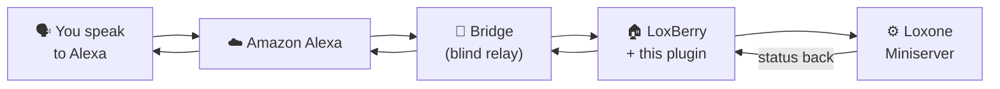

# Alexa Aloxberry — User Documentation

🇩🇪 **[Diese Dokumentation auf Deutsch →](../de/README.md)**

> ⚠️ **Public beta (v0.5.0).** This release is a public beta for a limited
> number of friendly‑user testers. It works, but expect rough edges, breaking
> changes between updates, and the occasional need to re‑link Alexa. Feedback
> is very welcome.

Control your **Loxone** home automation by voice through **Amazon Alexa** —
"Alexa, turn off the living-room lights", "Alexa, set the bedroom to 21 degrees",
"Alexa, close the blinds".

This plugin runs on your **LoxBerry** and connects your Loxone Miniserver to the
Alexa Smart Home skill **"Aloxberry"**. You decide exactly which Loxone components
Alexa can see and what it is allowed to do with them.

---

## What it does

- **Voice control** of lights, blinds, heating, music zones, scenes and more.
- **Status feedback**: Alexa can tell you the current temperature, whether a
  window is open, etc., and react to changes in **Routines**.
- **You pick the devices**: nothing from your Loxone is exposed automatically.
  You explicitly add each control in the plugin's *Devices* tab.
- **Multi-tenant by design**: one shared, free, open-source cloud backend
  serves many LoxBerry users — but the cloud never sees your Loxone data in
  the clear (see *Security*).

---

## Main features

| Area | What you get |
|------|--------------|
| Lighting | On/off, dimming, colour, colour temperature, light scenes |
| Shading | Blinds, shutters, windows, gates — set position by voice |
| Climate | Room controller / AC: set target temperature, mode, fan speed |
| Ventilation | On/off, speed, mode (timed override) |
| Audio | Loxone Music Server zones: volume, mute, play/pause, source |
| Scenes | Loxone push-buttons & sequences as Alexa Scenes / Routines |
| Sensors | Presence, window/contact, temperature, humidity (read-only) |
| Safety controls | Master off switch, "pause while a Virtual Status is on" gate |

---

## Documentation

| Topic | Read this |
|-------|-----------|
| 🔒 **Why it is safe to use** | [security.md](security.md) |
| 🛠️ **Requirements & setup** | [setup.md](setup.md) |
| 🔗 **Loxone ↔ Alexa device mapping** | [devices.md](devices.md) |
| 💡 **Tips & how-tos** (light moods, audio favorites …) | [tips.md](tips.md) |
| 🎵 **Audio players & music favorites** | [audio.md](audio.md) |

German versions: [Sicherheit](../de/security.md) ·
[Einrichtung](../de/setup.md) · [Geräte-Zuordnung](../de/devices.md) ·
[Tipps](../de/tips.md) · [Audio](../de/audio.md)

> Looking for the technical/architecture documentation? See
> [`doc/dev/`](../../dev/README.md) (English, for developers & self-hosters).

---

## In short — is anything required besides a LoxBerry?

**No.** You need a **LoxBerry 3.0 or newer** (which ships Node.js 18 by default,
as required by the plugin) with this plugin installed, and a Loxone Miniserver
it already talks to. Older LoxBerry versions are not supported. The cloud
parts (AWS Lambda + the dispatch *bridge*) are **provided by the project for
free** and shared by all users.

If you would rather not rely on the community infrastructure, you **can run your
own bridge and your own AWS Lambda backend** — everything is open source. See
[setup.md → Running your own infrastructure](setup.md#running-your-own-infrastructure).

---

## License

Apache License 2.0. Copyright © 2026 Martin Korndörfer.
