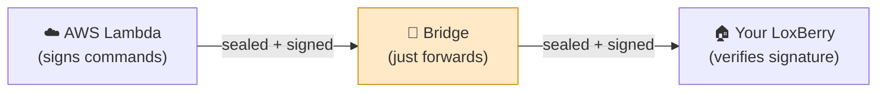

# Why Aloxberry is safe to use

[← Back to overview](README.md) · 🇩🇪 [Deutsch](../de/security.md)

Connecting a home automation system to a cloud voice assistant rightly makes
people nervous. Aloxberry is built around the assumption that **you distrust the
cloud by default**. This page explains the concrete reasons it is safe.

---

## 1. Everything is open source

There are no closed binaries and no hidden services. The complete code — the
LoxBerry plugin, the dispatch *bridge*, and the AWS Lambda backend — is public
and auditable. You can read exactly what runs, and you can run your own copy of
every cloud component if you want to (see
[setup.md → Running your own infrastructure](setup.md#running-your-own-infrastructure)).

## 2. The bridge is blind to your commands

Between Amazon and your LoxBerry sits a small relay called the **bridge**. It
exists only so Alexa can reach your LoxBerry without you opening any ports or
exposing your home to the internet.

The crucial point: **the bridge cannot read or forge your commands.**

Every command is **cryptographically signed (HMAC‑SHA256) end‑to‑end** between
the AWS Lambda and your plugin, using a secret that **only those two ever
hold**. The bridge sees opaque, signed bytes. It can pass them along or refuse
to — but it **cannot change a command, invent a new one, or eavesdrop on what
you are controlling**. A malicious or compromised bridge still cannot turn your
house into its puppet.

The bridge also keeps **no database** — it holds connections in memory only and
has nothing to back up or leak. If you prefer, you can host the bridge
yourself.

## 3. Your LoxBerry is never exposed to the internet

The plugin **dials out** to the bridge over an encrypted WebSocket connection.
You do **not** open a port, you do **not** need a public IP, and your LoxBerry
is **not** reachable from the internet because of this plugin. The connection is
always initiated from inside your network.

## 4. Your Loxone credentials never leave your LoxBerry

The plugin reuses the Miniserver connection that LoxBerry already manages. Your
Loxone username and password stay on the LoxBerry. They are **never** sent to
the bridge, to AWS, or to Amazon.

## 5. Nothing is exposed without your explicit consent

Discovery is **opt‑in, per device**. Out of the box Alexa sees **nothing**. A
Loxone control becomes visible to Alexa only after **you** add it in the
*Devices* tab and save. Anything you don't add stays invisible — no commands,
no status, nothing.

## 6. You have prominent off switches

The *Devices* tab gives you hard stops, not buried settings:

| Control | Effect |
|---------|--------|
| **Alexa integration active** (master switch) | When off, the plugin **cuts all bridge communication**. Alexa cannot reach this LoxBerry at all until you turn it back on. |
| **Pause Alexa commands while a Virtual Status is on** | While the Loxone **Virtual Status** you select is On, Alexa **commands to the Miniserver are blocked**, while status still flows back. A safe one‑way mode. See §7a for how to wire it. |
| **Per‑device "Enabled" checkbox** | Hides a single device from Alexa without losing its configuration. |
| **"Kill all Alexa pairings"** (danger zone) | Generates a fresh plugin identity. **Every existing Alexa link instantly stops working** and must be re‑linked from the Alexa app — your emergency "disconnect everything" button. |

## 6a. Best practice: the "disable Alexa control" Virtual Status

Loxone does **not** offer any way for an external system to read whether a
custom operating mode (*Betriebsart*, e.g. "Silentio", "Abwesend") is
active — `globalStates.operatingMode` only ever reports the calendar
weekday/season, never your custom modes. So this plugin deliberately does
**not** try to read operating modes. Instead it watches one **Virtual
Status** that *you* control in Loxone Config. Recommended setup:

1. In **Loxone Config**, add a **Virtual Status** object.
2. Name it clearly, e.g. **"disable Alexa control"**.
3. Wire its input to whatever should pause Alexa:
   - a **manual switch** (a virtual or physical switch you flip yourself), and/or
   - directly to an **operating mode**, e.g. the **"Abwesend"** (Away)
     Betriebsmodus output — so leaving the house auto‑pauses Alexa.
   (You can OR several sources together — switch *or* Abwesend.)
4. Save to the Miniserver so the new Virtual Status appears in the
   plugin's catalogue.
5. In the plugin's **Devices** page, enable **"Pause Alexa commands while
   a Virtual Status is on"** and select your **"disable Alexa control"**
   Virtual Status from the list. Save.

Only Virtual Status objects are listed and accepted — nothing else. While
that Virtual Status is **On**, Alexa can no longer change anything on the
Miniserver (status still flows back to Alexa). If the plugin can't yet see
the value, it errs **open** (commands allowed) rather than silently
blocking the wrong thing.

## 7. The link is yours to grant and revoke

Linking happens via a **single‑use 10‑character pair code** that you generate in
the plugin and paste into the Alexa app. It expires after 10 minutes. No
passwords are shared with Amazon. Unlinking the skill in the Alexa app, or
hitting "Kill all Alexa pairings", revokes access.

## 8. A gate can demand a spoken code before it opens

Everything above is about keeping *other people* out of your system. This one
is different: it guards against someone who is legitimately in earshot of your
Echo — a visitor, a delivery, a child, a voice from an open window.

A Loxone gate exposed in the **garage door** category is treated by Amazon as a
garage door, which means:

> *"Alexa, open the garage door."* → *"What is your voice code?"*

The command only reaches your LoxBerry after the code matches. Three properties
make this worth having:

- **The code is checked in Amazon's cloud, before the command is ever sent.**
  A wrong answer produces no traffic at all — your Miniserver never hears about
  the attempt.
- **Nothing in this project ever holds the code.** Not the plugin, not the
  bridge, not the AWS Lambda. It cannot leak from here, because it is not here.
- **Only opening is challenged.** Closing always goes straight through — being
  locked out of shutting your own gate is the worse failure.

It is **opt‑in per gate**, because it costs you partial positions and is not
available in Dutch. Setup, trade‑offs and troubleshooting are in
**[gates.md](gates.md)**.

---

## Summary

| Concern | How Aloxberry addresses it |
|---------|--------------------------|
| "Can the cloud spy on my home?" | End‑to‑end signing; the bridge sees only opaque bytes; no central store of your data. |
| "Will this open my LoxBerry to attackers?" | No inbound ports; the plugin only dials out. |
| "Do my Loxone passwords go to Amazon?" | No — they never leave the LoxBerry. |
| "What gets exposed?" | Only what you explicitly add, device by device. |
| "Can I stop it instantly?" | Master off switch, operating-mode pause, and a one-click pairing kill. |
| "Can someone in the room just shout my gate open?" | Not if you expose it as a garage door — Alexa demands a spoken code first, checked in Amazon's cloud. |
| "Do I have to trust the project's servers?" | No — every cloud component is open source and self‑hostable. |
