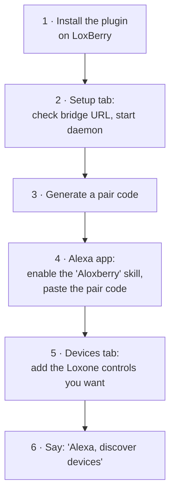

# Requirements & setup

[← Back to overview](README.md) · 🇩🇪 [Deutsch](../de/setup.md)

## What you need

| Requirement | Notes |
|-------------|-------|
| **A LoxBerry** | **Version 3.0 or newer is required.** Older LoxBerry versions are not supported. |
| **Node.js 18 or newer** | Required by the plugin daemon. LoxBerry 3.0 ships Node.js 18 by default, so a stock LoxBerry 3.0 already satisfies this. |
| **A Loxone Miniserver** | Already configured in LoxBerry (Settings → Miniserver). The plugin reuses that connection — you do **not** enter Loxone credentials here. |
| **An Amazon account with Alexa** | The Alexa app on your phone, signed in. |
| **Internet access from the LoxBerry** | Outbound only. No port forwarding, no public IP, no DynDNS required. |

Nothing else. The cloud parts (AWS Lambda backend + the dispatch *bridge*) are
**provided by the project for free**. Advanced users can self‑host them — see
[Running your own infrastructure](#running-your-own-infrastructure).

---

## Setup, step by step

### 1. Install the plugin

Install it like any LoxBerry plugin (Plugin Management → upload the `.lbplugin`
file, or use the auto‑update URL). A background service (the *daemon*) is set up
and starts automatically at boot.

### 2. Open the *Setup* tab

You will see live status for **Daemon**, **Bridge** and **Miniserver**.

- The **Bridge URL** is pre‑filled with the community bridge. Leave it as is
  unless you run your own.
- **Local API port** can stay at its default.
- Click **Start** if the daemon isn't running. *Bridge* should go green
  ("connected"); *Miniserver* should go green once it has read your Loxone
  structure.

### 3. Generate a pair code

In the **Link to Alexa** card, click **Show pair code**. You get a
**10‑character, single‑use code that expires in 10 minutes**. Copy it.

### 4. Link the skill in the Alexa app

In the Alexa app: **More → Skills & Games → search "Aloxberry" → Enable to use →
Link account**. Paste the pair code into the form and submit. The form
auto‑uppercases the code; it uses an unambiguous alphabet (no `O`/`0`,
`I`/`1` confusion).

When the form confirms success, the account is linked. Active links appear back
in the plugin under **Active pairings**.

### 5. Add the devices you want

Go to the **Devices** tab. On the left is your **Loxone catalogue** (rooms,
controls, types — read from your Miniserver). For each control you want Alexa to
use:

1. Click **Add**. It moves to the **Exposed to Alexa** list.
2. Adjust the **Friendly name** (what you say: *"Alexa, turn on …"*) — keep it
   unique and easy to pronounce.
3. Optionally change the **Category**, **Capabilities** and per‑device
   **Settings**. See [devices.md](devices.md) for what each option means and
   which Loxone control maps to which Alexa feature.
4. Click **Save changes**.

### 6. Let Alexa discover them

Say **"Alexa, discover devices"** (or use *Devices → Discover* in the app).
Your new devices appear and are ready for voice control. Repeat discovery
whenever you add or rename devices.

---

## Day‑to‑day & troubleshooting

| Symptom | Check |
|---------|-------|
| Bridge shows "disconnected" | Is the daemon running? Does the LoxBerry have internet? Is the Bridge URL correct? |
| Miniserver shows "disconnected" | Check LoxBerry's Miniserver settings; the plugin reuses that connection. |
| A new device doesn't appear in Alexa | Did you **Save changes**, then run **"Alexa, discover devices"**? Is its "Enabled" box checked? |
| Alexa says a device is unresponsive | Daemon stopped, master switch off, or the operating‑mode pause is active. |
| Want to revoke everything fast | *Setup → Danger zone → Kill all Alexa pairings*, then re‑link. |

Logs are available in the **Logs** tab (and via SSH for a live tail).

### Miniserver connection mode

By default the daemon keeps **one permanent WebSocket** to the Miniserver and
receives state changes instantly (*Live* mode). A few Miniservers — observed
on Gen 2 hardware — can develop network‑stack problems under long‑lived
connections, up to the Ethernet interface freezing entirely.

If that happens to you, switch *Setup → Settings → Miniserver connection* to
**Polling**. The daemon then holds **no permanent connection at all**: at the
configured interval (default 10 minutes) it connects briefly, reads a full
state snapshot, and disconnects again.

Trade‑off: state changes (sensor values, manually switched lights, …) reach
Alexa with up to one interval of delay — visible in the Alexa app and in
Routines triggered by device state. **Voice commands are not affected**: they
are executed immediately in both modes, because commands use short one‑shot
HTTP requests anyway.

---

## Running your own infrastructure

Everything is open source. You are not required to use the project's shared
cloud — you can run the two cloud pieces yourself:

- **Your own bridge.** A small, stateless relay (Node.js). The recommended
  deployment is Docker Compose + Caddy, which obtains a Let's Encrypt
  certificate automatically; Cloudflare Tunnel is supported for
  CGNAT / no‑public‑IP situations. Then just set its URL in the *Setup* tab's
  **Bridge URL** field. Full instructions: [`bridge/README.md`](../../../bridge/README.md)
  · technical background: [dev docs → Bridge](../../dev/bridge.md).
- **Your own AWS Lambda backend.** Deployed with AWS SAM from the
  [`aws/`](../../../aws/) directory. This means your own private Alexa skill.
  Technical background: [dev docs → AWS backend](../../dev/aws-backend.md).

Because commands are signed end‑to‑end, even when you use the community bridge
it never sees your commands in the clear (see [security.md](security.md)).
Self‑hosting is about **independence and control**, not about plugging a
security hole.
